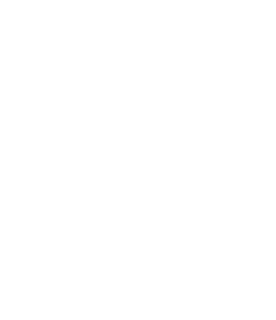

# Airbnb Clone Backend: Features and Functionalities

This document outlines the core features and functionalities supported by the Airbnb Clone backend.

## 🔐 Authentication & Authorization
- User registration and login
- Role-based access control (Admin, Host, Guest)

## 🏠 Property Management
- Add, edit, delete, and view properties
- Filter by location, price, amenities

## 📅 Booking System
- Availability checking
- Book, cancel, and manage bookings
- Booking statuses and timelines

## 💳 Payments
- Integrate payment gateways
- Generate receipts
- Refunds

## 🧑‍💼 Admin Panel
- Manage users
- Analytics dashboard

## 🧾 Reviews & Ratings
- Users can review and rate properties

## 📊 Dashboard (optional)
- Host and Admin statistics view

## 🖼️ Diagram
See the visual representation of the backend system below.

